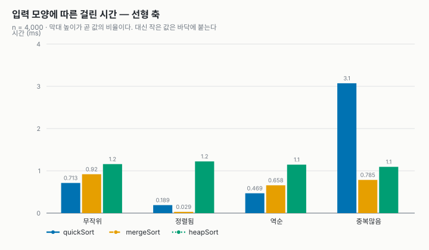
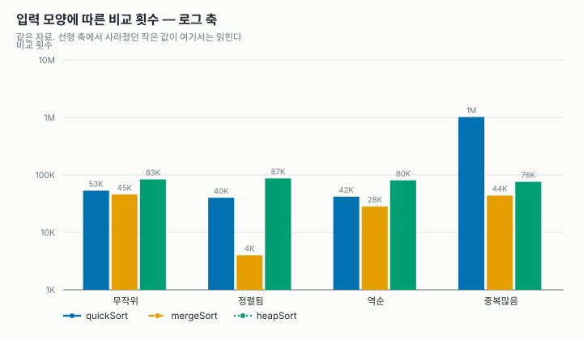
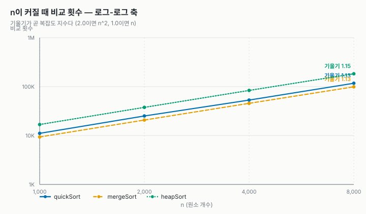

# 정렬 비교 보고서 — 퀵 · 병합 · 힙

- 과목: 고급알고리즘 (SIT2001-01)
- 작성자: 박예진 (2026193223)
- 비교 대상: 퀵 정렬 · 병합 정렬 (수업에서 배운 정렬), 힙 정렬 (배우지 않은 정렬)
- 실행: `make test` (유닛 테스트 42개) · `make run` (비교표) · `make charts` (그래프)

샘플 저장소(hw1-sample-2026)의 공통 인터페이스(`SortAlgorithm`)와 측정 도구(`bench.c`)를 재사용하고,
정렬 표(`src/sort.c`의 `SORT_ALGORITHMS[]`)를 세 정렬로 교체했다.

---

## 1. 알고리즘

| 정렬 | 평균 | 최악 | 추가 메모리 | 안정성 | 파일 |
| --- | --- | --- | --- | --- | --- |
| 퀵 | O(n log n) | O(n²) | O(log n) 재귀 스택 | 불안정 | `src/quickSort.c` |
| 병합 | O(n log n) | O(n log n) | O(n) | 안정 | `src/mergeSort.c` |
| 힙 | O(n log n) | O(n log n) | O(1) | 불안정 | `src/heapSort.c` |

- **퀵 정렬**: 가운데 원소를 피벗으로 Lomuto 분할. 짧은 쪽만 재귀해 깊이를 O(log n)으로 제한.
- **병합 정렬**: 왼쪽 절반을 보조 배열에 복사해 병합. `<=` 비교로 안정성 유지, 이미 이어진 구간은 병합 생략.
- **힙 정렬**: 최대 힙을 만든 뒤 루트(최댓값)를 맨 뒤로 보내고 `siftDown`으로 복구하기를 반복.

### 테스트 수정

샘플 테스트는 "모든 정렬이 안정적이고 추가 메모리가 원소 한 칸"이라고 가정했다.
불안정 정렬(퀵·힙)과 O(n) 메모리 정렬(병합)을 넣기 위해 **안정 정렬일 때만 안정성 검사**,
**추가 메모리는 원소 한 칸 이상**으로 일반화했다. `make test` 결과 42 checks, 0 failures.

---

## 2. 실험 결과

### 입력 모양별 (n = 4,000, 3회 평균)

| 입력 | 정렬 | 시간(ms) | 비교 | 이동 | 메모리 | 재귀깊이 | 안정성(실측) |
| --- | --- | --- | --- | --- | --- | --- | --- |
| 무작위 | quickSort | 0.713 | 53,143 | 78,075 | 8 B | 7 | yes |
| 무작위 | mergeSort | 0.920 | 45,482 | 66,293 | 16,016 B | 13 | yes |
| 무작위 | heapSort | 1.159 | 83,455 | 133,131 | 8 B | 1 | yes |
| 정렬됨 | quickSort | 0.189 | 39,917 | 12,282 | 8 B | 11 | yes |
| 정렬됨 | mergeSort | 0.029 | 3,999 | 0 | 16,016 B | 13 | yes |
| 정렬됨 | heapSort | 1.223 | 86,576 | 141,426 | 8 B | 1 | yes |
| 역순 | quickSort | 0.469 | 41,684 | 68,478 | 8 B | 11 | yes |
| 역순 | mergeSort | 0.658 | 28,175 | 71,632 | 16,016 B | 13 | yes |
| 역순 | heapSort | 1.147 | 80,151 | 124,308 | 8 B | 1 | yes |
| 중복많음 | quickSort | 3.072 | **1,012,386** | 45,018 | 8 B | 3 | **no** |
| 중복많음 | mergeSort | 0.785 | 43,767 | 63,649 | 16,016 B | 13 | yes |
| 중복많음 | heapSort | 1.094 | 75,542 | 116,982 | 8 B | 1 | **no** |

### n을 키우며 (무작위 입력)

| n | quick 비교 | merge 비교 | heap 비교 | quick(ms) | merge(ms) | heap(ms) |
| --- | --- | --- | --- | --- | --- | --- |
| 1,000 | 11,097 | 9,350 | 16,808 | 0.162 | 0.187 | 0.246 |
| 2,000 | 25,093 | 20,730 | 37,684 | 0.342 | 0.399 | 0.544 |
| 4,000 | 53,143 | 45,482 | 83,455 | 0.731 | 1.002 | 1.319 |
| 8,000 | 117,066 | 99,012 | 182,934 | 1.694 | 2.169 | 2.621 |

측정값 원본: [`results.csv`](results.csv)

---

## 3. 분석

1. **평균적으로 퀵이 가장 빠르다.** 무작위 입력에서 시간은 퀵 < 병합 < 힙. 병합은 비교가 가장 적지만 보조 배열 복사 비용이 든다.
2. **힙은 비교 횟수가 가장 많다.** n=8,000에서 병합의 약 1.8배. siftDown마다 두 자식과 비교하고, 루트로 올라온 작은 값이 거의 바닥까지 내려가야 하기 때문이다.
3. **셋 다 실제로 O(n log n).** n이 2배일 때 비교 횟수는 약 2.2배(O(n²)이면 4배). 로그-로그 기울기 약 1.13.
4. **퀵은 중복이 많으면 무너진다.** 중복많음 입력에서 비교 1,012,386번(무작위의 약 19배). Lomuto 분할은 피벗과 같은 값을 한쪽으로 몰아, 같은 값 약 500개 구간이 O(n²)처럼 동작한다(500²/2 × 8그룹 ≈ 100만). 3-way 분할로 개선할 수 있다.
5. **병합은 정렬된 입력에 강하다.** 비교 n−1번, 이동 0번. 이어진 구간 병합 생략 덕분.
6. **힙은 입력 모양을 타지 않는다.** 네 입력 모두 약 1.1~1.2ms. 역순 입력은 이미 최대 힙 모양이라 비교가 가장 적다.
7. **메모리와 재귀 깊이의 트레이드오프.** 병합만 보조 배열(16,016 B)을 쓰고, 재귀 깊이는 힙 1 · 퀵 3~11 · 병합 11~14.
8. **불안정 정렬이 늘 순서를 깨는 건 아니다.** key 중복이 거의 없는 입력에서는 퀵·힙도 안정성 검사를 통과했고, 중복많음 입력에서야 불안정성이 드러났다.

## 4. 결론 및 한계

- 일반적인 경우 → **퀵** (중복이 많으면 3-way 분할 필요)
- 안정성이 필요하거나 거의 정렬된 데이터 → **병합**
- 메모리가 부족하고 최악 보장이 필요 → **힙**

한계: 시간은 한 기계에서 잰 값이다. 퀵의 재귀 스택은 메모리 열에 잡히지 않는다. 3-way 분할은 구현하지 않았다. n은 8,000까지만 측정했다.
